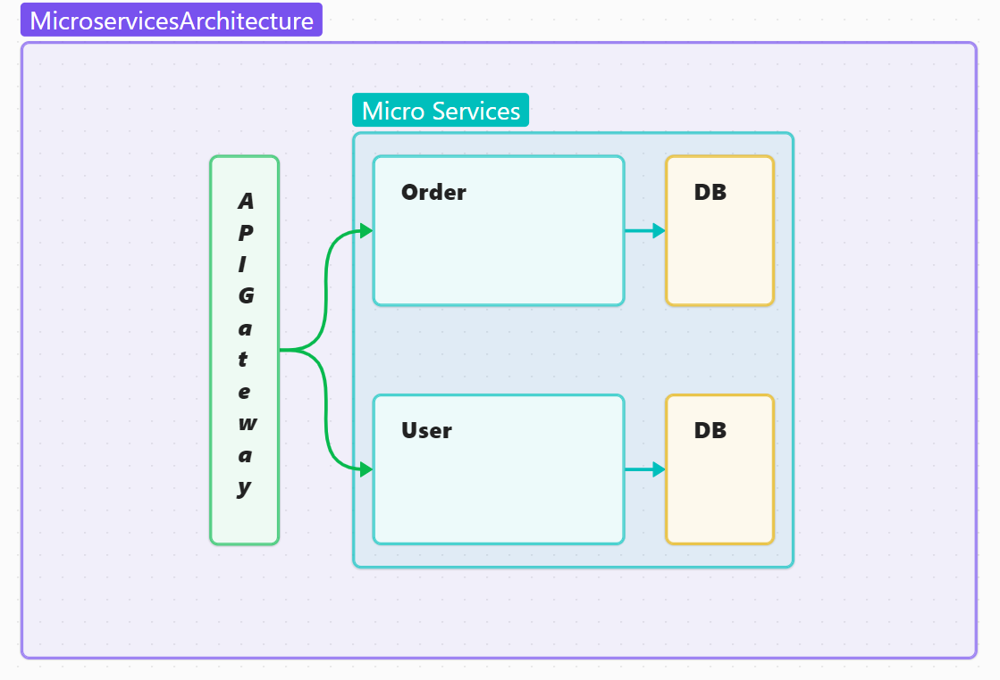

# Microservices Architecture Overview

**Microservices architecture** is an architectural style where an application is built as a collection of small, loosely coupled, independently deployable services. Each service corresponds to a specific business functionality and communicates with others through lightweight protocols like HTTP or messaging queues.

## Key Characteristics of Microservices:

1. **Independent Services**: Each microservice is a self-contained unit with its own business logic and data. It can be developed, deployed, and scaled independently.
   
2. **Single Responsibility**: A microservice typically focuses on a specific business capability or domain, adhering to the principle of "single responsibility".

3. **Decentralized Data Management**: Instead of having a centralized database, each service manages its own database, ensuring that each service is autonomous and can work independently.

4. **Communication via APIs**: Microservices communicate with each other using lightweight protocols, such as REST (HTTP) or messaging protocols (e.g., RabbitMQ, Kafka).

5. **Technology Agnostic**: Different services can be implemented using different programming languages or frameworks, depending on what best fits the business requirement.

6. **Scalability**: Microservices can be scaled independently, allowing efficient resource utilization. For example, if one service experiences high demand, it can be scaled without affecting others.

7. **Fault Isolation**: If one microservice fails, it doesn't affect the entire system. Other services continue to operate, which improves the overall resilience and reliability of the application.

8. **Continuous Delivery and Deployment**: Microservices allow for continuous integration and continuous deployment (CI/CD), helping teams to release features or fixes faster.

## Advantages of Microservices Architecture:

- **Flexibility**: Since services are independent, teams can work on them concurrently and deploy them without affecting other parts of the system.
- **Technology Diversity**: Teams can choose different technologies (programming languages, databases, etc.) for each service depending on the use case.
- **Fault Isolation**: Issues in one service don't necessarily bring down the whole system.
- **Faster Time to Market**: Independent services can be updated and deployed more quickly, which accelerates development cycles.

## Challenges of Microservices Architecture:

1. **Complexity**: The number of services can grow quickly, making the system difficult to manage and monitor.
2. **Distributed Systems Issues**: Managing network communication, service discovery, and coordination between services introduces additional complexity.
3. **Data Consistency**: Managing data consistency across services without a centralized database can be tricky, especially in cases where strong consistency is required.
4. **Deployment Overhead**: Handling deployments, monitoring, and scaling of numerous microservices can require additional tooling and infrastructure.
5. **Latency**: Since microservices often communicate over a network, they might experience higher latency than monolithic systems, particularly if many services need to be involved in a single request.

## Common Tools and Technologies in Microservices:

- **API Gateways**: For managing client requests and routing them to the correct microservices. Examples: Kong, Nginx, Zuul.
- **Service Discovery**: Helps microservices find and communicate with each other. Examples: Consul, Eureka.
- **Containerization**: Microservices are often containerized using Docker, which helps in isolating environments and managing dependencies.
- **Orchestration**: Kubernetes is a popular tool for managing and orchestrating containers.
- **Message Queues**: Used for asynchronous communication between microservices. Examples: RabbitMQ, Kafka.
- **Monitoring and Logging**: Tools like Prometheus, Grafana, ELK Stack (Elasticsearch, Logstash, Kibana), and OpenTelemetry help in monitoring microservices and logging events.
- **CI/CD Pipelines**: Jenkins, GitLab, and other tools are used to automate the build, testing, and deployment process for microservices.

## Example of Microservices in Practice:

Imagine an e-commerce platform with several microservices:

- **User Service**: Handles user registration, login, and authentication.
- **Product Service**: Manages products, categories, and inventory.
- **Order Service**: Manages customer orders and payment.
- **Shipping Service**: Handles the shipping and tracking of orders.

Each of these services would interact with its own database and could be developed and deployed independently. For example, if the product service needs an update, it can be deployed without affecting the order or shipping services.
 